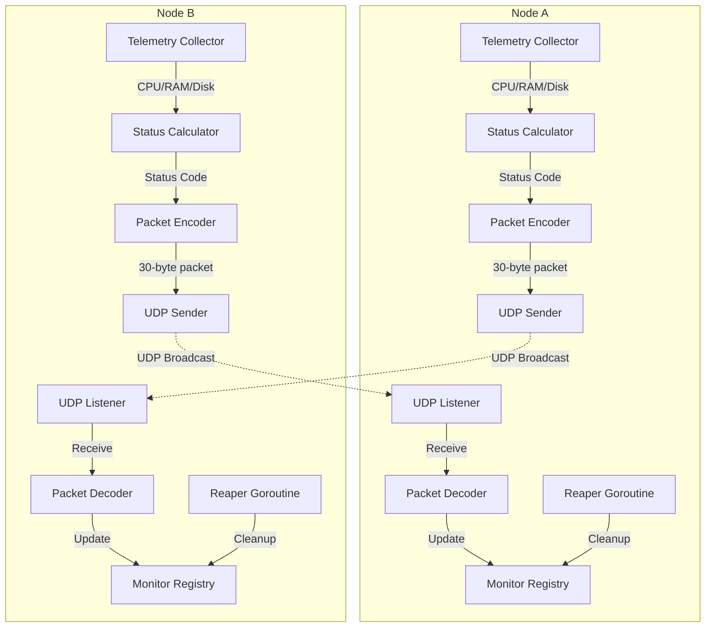

# PulseCheck: High-Efficiency Distributed Health Monitor

PulseCheck is a lightweight, low-latency health monitoring system built in Go. It uses a decentralized UDP heartbeat mechanism to track the availability and resource pressure of distributed nodes in real-time.

## 1. Real-World Context

In large-scale systems (like VOD pipelines or global VPN networks), knowing the "health" of an edge node is critical. While TCP-based health checks (like HTTP `/healthz`) are common, they introduce significant overhead at scale due to the 3-way handshake and kernel resource mapping.

PulseCheck solves this by using **UDP Heartbeats with Binary Encoding**, allowing a single monitor to track thousands of nodes with minimal CPU and memory overhead.

**Example Use Case:** In a video-on-demand (VOD) pipeline, a load balancer needs to know if an edge node is 99% full before sending it new video files. PulseCheck provides real-time telemetry (CPU, RAM, disk) with status codes (OK/Warn/Critical) to enable intelligent routing decisions.

## 2. Architecture & Design Decisions

### Why UDP?

Unlike TCP, UDP is connectionless. This allows nodes to "fire and forget" heartbeats. If a packet is lost, the system doesn't stall. We handle reliability at the application layer by requiring **N missed pulses** before marking a node as "Offline."

**Benefits:**
- No 3-way handshake overhead
- Minimal kernel resource usage
- Non-blocking I/O with goroutines
- Suitable for high-frequency health checks

### Binary Protocol over JSON

To save bandwidth and reduce GC (Garbage Collection) pressure, I implemented a custom binary protocol.

**Packet Structure (30 Bytes):**
```
[0]      uint8:   Version (for backward compatibility)
[1-16]   [16]byte: Node UUID
[17-24]  int64:   Unix Nano Timestamp (for RTT/Latency tracking)
[25]     uint8:   Status Code (0: OK, 1: Warn, 2: Critical)
[26-29]  uint32:  CRC32 Checksum (for packet integrity verification)
```

**Why 30 bytes?** A typical JSON health check payload is 200-500 bytes. Our binary protocol is **90-94% smaller**, reducing network bandwidth and GC pressure when monitoring thousands of nodes.

**Checksum Protection:** The CRC32 checksum ensures packet integrity at the application layer. UDP provides no reliability guarantees, so corrupted packets are detected and discarded, preventing invalid data from affecting the health monitoring system.

### The "Reaper" Pattern

The registry maintains an in-memory map of known nodes protected by a `sync.RWMutex`. A background "Reaper" goroutine runs on a ticker to prune nodes that haven't checked in within the timeout window.

**Thread Safety:** All registry operations use `sync.RWMutex` to allow concurrent reads while protecting writes. This enables high-throughput monitoring with minimal lock contention.

### Telemetry Integration

PulseCheck collects real-time system metrics using [`shirou/gopsutil`](https://github.com/shirou/gopsutil):

- **CPU Usage:** Percentage of CPU utilization
- **RAM Usage:** Percentage of memory used
- **Disk Usage:** Percentage of disk space used

These metrics are used to calculate a **Status Code**:
- **OK (0):** All metrics below warning thresholds
- **Warn (1):** Any metric exceeds warning threshold (configurable, defaults: CPU > 70%, RAM > 80%, Disk > 85%)
- **Critical (2):** Any metric exceeds critical threshold (configurable, defaults: CPU > 90%, RAM > 95%, Disk > 95%)

## 3. Architecture Diagram



### Data Flow

1. **Telemetry Collection:** Each node periodically collects CPU, RAM, and disk metrics
2. **Status Calculation:** Metrics are compared against configurable thresholds to determine status code
3. **Packet Encoding:** Status code, node UUID, and timestamp are packed into a 30-byte binary packet (26 bytes data + 4 bytes CRC32 checksum)
4. **UDP Broadcast:** Packet is sent to all known peers via UDP
5. **Packet Reception:** Non-blocking UDP listener receives packets in goroutines
6. **Registry Update:** Decoded packets update the monitor registry with node status
7. **Reaper Cleanup:** Background goroutine removes nodes that haven't sent heartbeats within the timeout window

## 4. Installation & Usage

### Prerequisites

- Go 1.21 or later
- Network access for UDP communication

### Installation

```bash
# Clone the repository
git clone <repository-url>
cd pulsecheck

# Download dependencies
go mod download
go mod tidy

# Build the application
make build

# Or build directly
go build -o bin/pulsecheck ./cmd/node
```

### Running a Node

```bash
# Run with default settings (port 9999, 5s heartbeat, 15s timeout)
./bin/pulsecheck

# Run with custom port and intervals
./bin/pulsecheck --port 8888 --heartbeat-interval 3s --timeout 10s

# Run with custom telemetry thresholds
./bin/pulsecheck \
  --cpu-warn-threshold 75 \
  --cpu-critical-threshold 95 \
  --ram-warn-threshold 85 \
  --ram-critical-threshold 98 \
  --disk-warn-threshold 90 \
  --disk-critical-threshold 98
```

### Running Multiple Nodes (Testing)

```bash
# Terminal 1: Node on port 9999
./bin/pulsecheck --port 9999 --node-id node1

# Terminal 2: Node on port 10000 (add peer manually or use discovery)
./bin/pulsecheck --port 10000 --node-id node2
```

### Command-Line Flags

| Flag | Default | Description |
|------|---------|-------------|
| `--port` | 9999 | UDP port to listen on |
| `--heartbeat-interval` | 5s | Time between heartbeats |
| `--timeout` | 15s | Time before marking node offline |
| `--node-id` | hostname | Unique identifier for this node |
| `--cpu-warn-threshold` | 70.0 | CPU percentage for Warn status |
| `--cpu-critical-threshold` | 90.0 | CPU percentage for Critical status |
| `--ram-warn-threshold` | 80.0 | RAM percentage for Warn status |
| `--ram-critical-threshold` | 95.0 | RAM percentage for Critical status |
| `--disk-warn-threshold` | 85.0 | Disk percentage for Warn status |
| `--disk-critical-threshold` | 95.0 | Disk percentage for Critical status |

## 5. Technical Deep Dive

### Packet Encoding/Decoding

The packet uses `encoding/binary` with `binary.BigEndian` (network byte order) for cross-platform compatibility:

```go
// Encoding: Pack fields into 30-byte buffer (26 bytes data + 4 bytes CRC32)
buf[0] = version
copy(buf[1:17], nodeUUID[:])
binary.BigEndian.PutUint64(buf[17:25], uint64(timestamp))
buf[25] = statusCode
checksum := crc32.ChecksumIEEE(buf[0:26])
binary.BigEndian.PutUint32(buf[26:30], checksum)

// Decoding: Unpack 30-byte buffer and verify checksum
receivedChecksum := binary.BigEndian.Uint32(buf[26:30])
expectedChecksum := crc32.ChecksumIEEE(buf[0:26])
if receivedChecksum != expectedChecksum {
    return error("packet corrupted")
}
version = buf[0]
copy(nodeUUID[:], buf[1:17])
timestamp = int64(binary.BigEndian.Uint64(buf[17:25]))
statusCode = buf[25]
```

### Thread Safety

The `Monitor` struct uses `sync.RWMutex` to protect the nodes map:

- **Read operations** (GetNodes, GetNodeCount) use `RLock()` for concurrent access
- **Write operations** (Update, StartReaper) use `Lock()` for exclusive access
- This design allows multiple goroutines to read node status simultaneously while ensuring atomic updates

### Performance Characteristics

**CPU Overhead:** Minimal. Each node:
- Collects metrics every heartbeat interval (default: 5s)
- Processes incoming packets in goroutines (non-blocking)
- Reaper runs every second (lightweight cleanup)

**Memory Overhead:** Low. Per-node storage:
- NodeInfo struct: ~100 bytes
- Packet buffer: 30 bytes (reused)
- Total per 1000 nodes: ~100 KB

**Network Bandwidth:** Ultra-low. Each heartbeat:
- 30 bytes per packet (26 bytes data + 4 bytes CRC32)
- Default 5s interval = 6 bytes/second per node
- 1000 nodes = ~6 KB/second total

### Telemetry Collection Methodology

PulseCheck uses `gopsutil` for cross-platform system metrics:

- **CPU:** `cpu.Percent(0, false)` - Average across all cores
- **RAM:** `mem.VirtualMemory()` - System memory usage
- **Disk:** `disk.Usage("/")` - Root partition usage

Metrics are collected synchronously during heartbeat generation to ensure consistency.

## 6. Design Decisions Summary

| Decision | Rationale |
|----------|-----------|
| **UDP over TCP** | Connectionless, no handshake overhead, suitable for high-frequency heartbeats |
| **Binary over JSON** | 92-95% smaller packets, reduced GC pressure, lower bandwidth |
| **30-byte fixed size** | Predictable packet size, easy validation, minimal parsing overhead |
| **Non-blocking UDP listener** | Goroutine-per-packet handling prevents blocking, enables high throughput |
| **Reaper pattern** | Background cleanup prevents memory leaks from stale nodes |
| **sync.RWMutex** | Allows concurrent reads while protecting writes, optimal for read-heavy workloads |
| **CRC32 Checksum** | 4-byte checksum ensures packet integrity, detects corruption at application layer |
| **Telemetry in status code** | Packet stays minimal (30 bytes), full metrics stored in registry for display |

## 7. Future Enhancements

Potential improvements for production use:

- **Multicast Discovery:** Automatic peer discovery via UDP multicast
- **Encryption:** Optional packet encryption for security-sensitive deployments
- **Metrics Export:** Prometheus/StatsD integration for observability
- **Persistent Storage:** Optional database backend for historical health data
- **Web Dashboard:** Real-time visualization of node health and telemetry

## License

[Your License Here]

## Contributing

[Your Contributing Guidelines Here]
